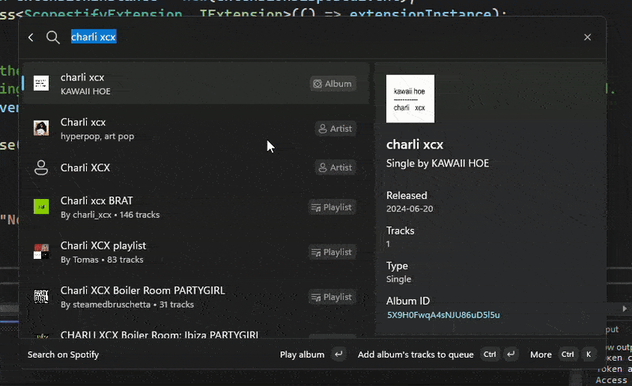

<h1 align=center>
    
</h1>

Control Spotify from the Command Palette

_Going from Charli XCX to Nils Frahm without a mouse_

## Features

<table>
<tbody>

<tr>
<td>

<figure>

<figcaption>Quickly like the currently playing track</figcaption>
</figure>

</td>
<td>

<figure>

<figcaption>Search for tracks, albums or playlists</figcaption>
</figure>

</td>
</tr>
<tr>
<td>

<figure>

<figcaption>See what's currently playing</figcaption>
</figure>

</td>
<td>

<figure>

<figcaption>Browse an album's tracks</figcaption>
</figure>

</td>
</tr>
<tr>
<td>

<figure>

<figcaption>Browse your playlists, quickly categorize the currently playing track into your playlists</figcaption>
</figure>

</td>
<td>

& more coming soon!

</td>

</tbody>
</table>

## Installation

For now, you need to build it from source :/

I'll publish it to the Microsoft Store soon!

### From Source

0. [Install PowerToys](https://github.com/microsoft/PowerToys/releases) and enabling the Command Palette module (`System Modules` > `Command Palette` in PowerToys settings)
1. Install [Visual Studio 2022](https://visualstudio.microsoft.com/vs/) (the Community edition is fine)
2. Clone this repository
3. Open the `ScopestifyExtension.sln` solution file in Visual Studio
4. Build and install: `Build` > `Deploy ScopestifyExtension` in the top menu
5. Reload Command Palette extensions (open command palette and type "reload")

## Usage

1. [Create a Spotify application](https://developer.spotify.com/dashboard/create)
   - Select "Web API" for "Which API/SDKs are you planning to use?"
   - Add `http://localhost:5543/callback` in "Redirect URIs"
   - Copy the Client ID and Client Secret, you'll need them later
2. Open the command palette, and search for "Authentiate with Spotify", then press Enter
3. Choose "Register your App". Enter the Client ID and Client Secret from step 1
4. A browser window should open, asking you to log in to Spotify and authorize the app
5. Once authenticated, you can use the command palette to control Spotify!

If at any point you get authentication-related errors, try going back to the "Authenticate with Spotify" page and choosing "Login to Spotify", then reload the command palette extensions.

## Security considerations

Your tokens are saved in plain-text to a file at `%UserProfile%\.scopestify\config.json`. Make sure that that file is not shared with anyone you don't trust.
