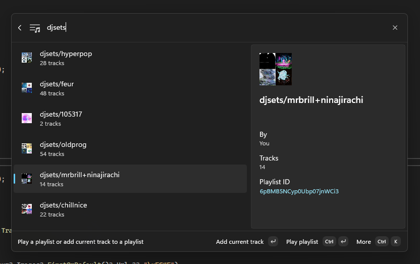

# Scopestify

Control Spotify from the Command Palette

## Features

<table>
<tbody>

<tr>
<td>

<figure>

<figcaption>Quickly like the currently playing track</figcaption>
</figure>

</td>
<td>

<figure>

<figcaption>Search for tracks, albums or playlists</figcaption>
</figure>

</td>
</tr>
<tr>
<td>

<figure>

<figcaption>See what's currently playing</figcaption>
</figure>

</td>
<td>

<figure>

<figcaption>Browse an album's tracks</figcaption>
</figure>

</td>
</tr>
<tr>
<td>

<figure>

<figcaption>Browse your playlists, quickly categorize the currently playing track into your playlists</figcaption>
</figure>

</td>
<td>

& more coming soon!

</td>

</tbody>
</table>
